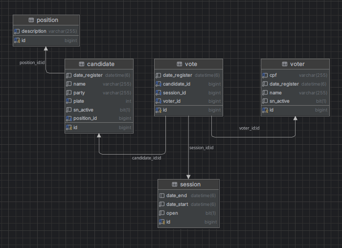

# Projeto de votação

Projeto para mostrar conhecimento para desafio de Pleno.

### 📋 Diagrama do banco de dados.



## 🚀 Começando

Essas instruções permitirão que você obtenha uma cópia do projeto em operação na sua máquina local para fins de desenvolvimento e teste.

### 📋 Pré-requisitos

De que coisas você precisa para instalar o software e como instalá-lo?

```
JAVA JDK 17; 
MAVEN 3; 
MYSQL;   
```

### 🔧 Instalação

Uma série de exemplos passo-a-passo que informam o que você deve executar para ter um ambiente de desenvolvimento em execução.

Diga como essa etapa será:

```shell
git clone https://github.com/Emersonfarias93/votingapi.git

cd votingapi

mvn spring-boot run
```
Links para acesso a Swagger: http://localhost:8083/swagger-ui/index.html

## 🛠️ Construído com

Mencione as ferramentas que você usou para criar seu projeto

* Spring Framework
* Java 17+
* Spring Data JPA
* REST com OpenAPI/Swagger
* [Maven](https://maven.apache.org/) - Gerente de Dependência

## ✒️ Autores

* **Emerson de Farias** - *Trabalho Inicial* - [Emersonfarias93](https://github.com/Emersonfarias93)
* **Emerson de Farias** - *Documentação* - [Emersonfarias93](https://github.com/Emersonfarias93)

---
⌨️ com ❤️ por [Emersonfarias93](https://gist.github.com/Emersonfarias93)